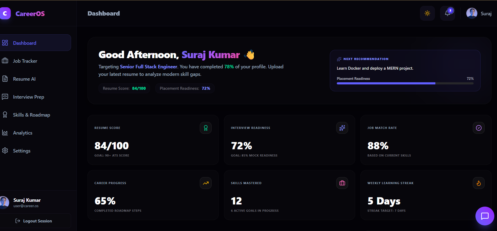
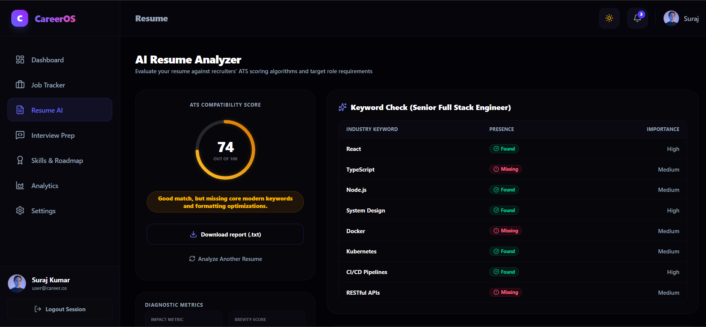
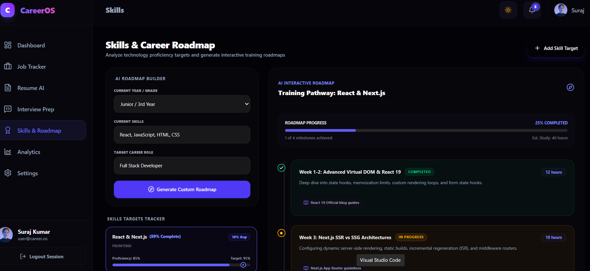
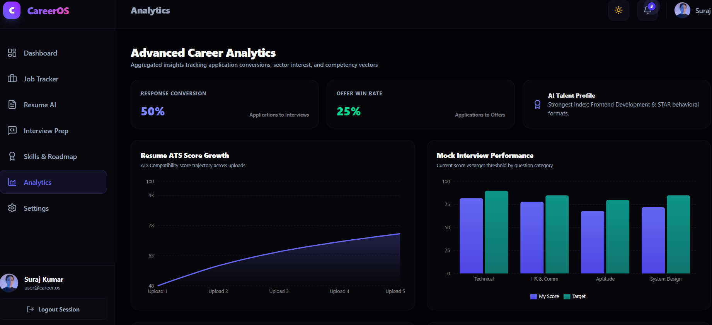

# 🚀 AI CareerOS

live: https://ai-careeros-theta.vercel.app/dashboard

  <strong>An AI-Powered Career Development Platform for Students and Job Seekers.</strong>

  AI CareerOS helps users analyze resumes, prepare for interviews, generate career roadmaps, track applications, and improve placement readiness using AI-powered insights.

---

## ✨ Features

### 📄 AI Resume Analyzer

* ATS Score Generation
* Skill Gap Detection
* Keyword Analysis
* Resume Improvement Suggestions
* PDF & DOCX Support

### 🎯 Career Roadmap Generator

* Personalized Learning Paths
* Role-Based Milestones
* Progress Tracking
* Goal-Oriented Recommendations

### 🎤 AI Interview Preparation

* Technical Questions
* HR Questions
* Aptitude Questions
* Dynamic Question Pools
* Performance Evaluation

### 📊 Career Analytics Dashboard

* Resume Score Tracking
* Placement Readiness Metrics
* Interview Performance Analysis
* Career Progress Visualization

### 💼 Job Tracker

* Track Applications
* Update Status
* Manage Interview Stages
* Dashboard Statistics

### 🤖 AI Career Assistant

* Career Guidance
* Resume Advice
* Interview Coaching
* Learning Recommendations

---

## 🛠️ Tech Stack

### Frontend

* Next.js
* React
* TypeScript
* Tailwind CSS
* Recharts

### Backend

* Node.js
* Express.js
* TypeScript

### Database

* MongoDB Atlas
* Mongoose

### Authentication

* JWT Authentication

### AI Integration

* Gemini API
* OpenRouter

### Deployment

* Vercel
* Render

---

## 📸 Screenshots

### Dashboard

### Resume Analyzer

### Skills & Roadmap

### Analytics

---

## 🏗️ Architecture

User
↓
Frontend (Next.js)
↓
API Layer
↓
Node.js + Express
↓
MongoDB Atlas
↓
AI Services (Gemini/OpenRouter)

---

## ⚙️ Installation

git clone <repo-url>

cd ai-career-dashboard

npm install

Frontend:
npm run dev

Backend:
npm run build
npm start

---

## 🔑 Environment Variables

Frontend

NEXT_PUBLIC_API_URL=your_backend_url

Backend

MONGODB_URI=your_mongodb_connection_string

JWT_SECRET=your_secret_key

OPENROUTER_API_KEY=your_key

GEMINI_API_KEY=your_key

---

## 🎓 Key Learning Outcomes

* Full Stack Development
* TypeScript Architecture
* AI Integration
* Resume Parsing
* Dashboard Analytics
* Authentication Systems
* MongoDB Data Modeling
* Responsive UI Design
* API Development
* SaaS Product Design

---

## 🚀 Future Improvements

* Real-Time AI Interview Simulation
* Voice-Based Mock Interviews
* Resume Version Management
* Job Recommendation Engine
* Placement Prediction Models
* PWA Support

---

## 👤 Author

Suraj Soni

GitHub: https://github.com/suraj-5021

LinkedIn: https://www.linkedin.com/in/suraj-soni-1773a5320

